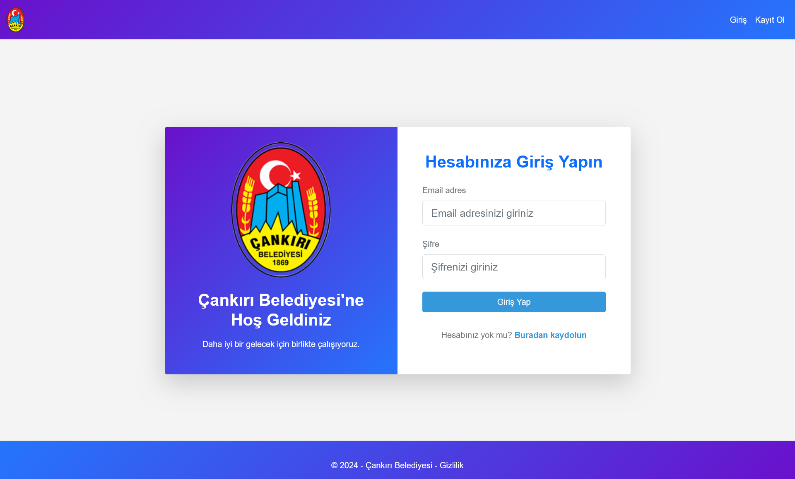
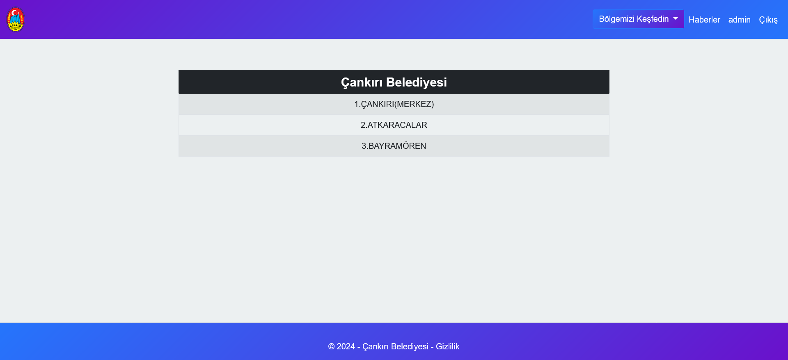

# Çankırı Promotion Website

This project is a city promotion website developed using **ASP.NET Core MVC**. While users can view various information, individuals with admin privileges can manage the content.

## 📌 Features

### 🏠 Home Page
This section contains basic information about the city, a scrolling slider, and a map showing the city's location.

**Screenshot:**  


---

### 👤 User System
This section allows users to register, log in, and access city information after logging in.

- **Login Page**
  Users can log in to access additional features.

  **Screenshot:**  
  

- **Registration Page**
  New users can register to create an account.

  **Screenshot:**  
  

- **User Homepage**
  After logging in, users can see personalized content and city details.

  **Screenshot:**  
  

- **District Information**
  Users can explore information about different districts of the city.

  **Screenshot:**  
  

- **News Page**
  Users can view the latest news about the city.

  **Screenshot:**  
  

- **Population Data**
  Users can view demographic and population statistics of the city.

  **Screenshot:**  
  

- **Touristic Promotion Page**
  Users can explore promotional content about the city's touristic attractions.

  **Screenshot:**  
  

---

### 🔧 Admin Panel
The admin panel allows administrators to manage user roles, slider images, and city information.

- **Admin Homepage**
  The homepage for the admin where management options are available.

  **Screenshot:**  
  

- **User Role Edit**
  Admins can edit user roles and manage user permissions.

  **Screenshot:**  
  

- **Slider Image Edit**
  Admins can manage and edit images in the city’s scrolling slider.

  **Screenshot:**  
  

- **Touristic Promotion Page (Admin)**
  Admins can add or edit content for the touristic promotion page.

  **Screenshot:**  
  

- **Create Touristic Promotion (Admin)**
  Admins can create new entries for the touristic promotion page.

  **Screenshot:**  
  

- **Population Data (Admin)**
  Admins can manage population data and statistics.

  **Screenshot:**  
  

- **District Admin Page**
  Admins can manage district-specific data for the city.

  **Screenshot:**  
  

- **Create News (Admin)**
  Admins can create and manage news entries for the city.

  **Screenshot:**  
  

---

## 🛠 Technologies
- **Backend:** ASP.NET Core MVC
- **Frontend:** HTML, CSS, JavaScript, Bootstrap
- **Database:** MySQL

## 🚀 Setup

1. **Clone the Project**
   ```bash
   git clone https://github.com/isaayan/aspnetcore-cankiri.git

2. **Install Dependencies To install the project's dependencies, run the following command**
   ```bash
   dotnet restore
   
3. **Create the Database**
- Open the appsettings.json file and update the database connection information.
- Run the following command to create the database
   ```bash
   dotnet ef database update
   
5. **Run the Project To run the project, use the following command**
   ```bash
   dotnet watch
